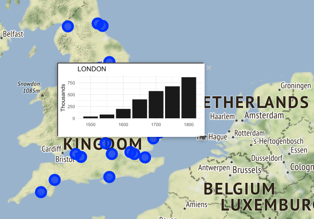

## europop-leaflet

This is an upload of a previously unpublished blogpost/tutorial piece
of content depicting construction of a leaflet-based map with popup
graphics using an interesting dataset of historical European city
populations. 

## Motivation

This was initially designed as a short tutorial for a potential Meetup workshop that never materialized that was turned into a blog post that was never published. The tutorial focuses on developing a leaflet map with popup ggplot2 charts like this:



## Try it

To run it locally on your computer simply clone this repository 
```
git clone https://github.com/dshkol/europop-leaflet.git
```
and open the html file in the `reports` directory in a browser.

## Modify it

Make changes by editing the `britain_pop_change.Rmd` file in the `reports` directory. Some easy changes to play around with include changing the area of interest from England and Wales to, for example, Germany, or Scandinavia. This can be done by adjusting the code in the Rmarkdown document and knitting to a new HTML file. 

```r
# Replace this
euro_cities <- left_join(europop, city_coords) %>% 
  st_as_sf(coords = c("lon", "lat"), crs = 4326) %>% 
  filter(region %in% c("England and Wales","Scotland"))
  
# With this
euro_cities <- left_join(europop, city_coords) %>% 
  st_as_sf(coords = c("lon", "lat"), crs = 4326) %>% 
  filter(region %in% c("Germany","Scandinavia"))
```

## Data

The [`europop`](https://github.com/mdlincoln/europop) package uses data from Jan De Vries' [_European Urbanization, 1500-1800_](https://books.google.ca/books/about/European_Urbanization_1500_1800.html?id=11yHAAAAIAAJ&redir_esc=y) (Cambridge: Harvard University Press, 1984), and includes data for European cities with populations of at least 10,000 individuals at some point between 1500-1800.
